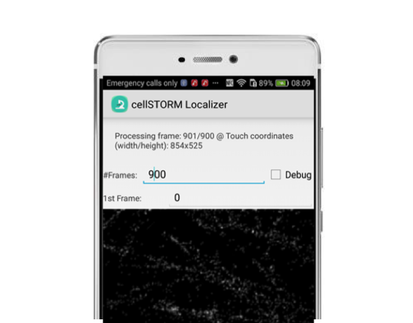

cellSTORM MATLAB Files
==============================

Based on paper by Benedict Diederich, Patrick Then, Alexander Jügler, Ronny Förster, Rainer Heintzmann

[Arxiv-Link](https://arxiv.org/abs/1804.06244)

## Introduction
The Matlab files are a collection of functions to prepare the training data as well as evaluation the results. It's a not-ordered list of files which were useful when training the GAN in Tensorflow. The major files will get a further explanation. 

All files were tested on MATLAB 2016b. 

## Simulating training

To produce training data we follow two different approaches. We rely on purely simulated data coming from ThunderSTORM. Addtionally we introduce experimental data from cellSTORM measurements coming from the Huawei P9. We localize it with TunderSTORM and then form datapairs. 

The datapairs are consisting groundtruth (GT) and degraded (i.e. measured, psf-convolved+noisy) frames. The GAN then tries to go back from degraded frames to localization maps (i.e. found center spot of a possible blinking fluorophore.). 

For a very good tutorial on how to prepare the TunderSTORM dataset please also have a look at the DeepSTORM repository [here](https://github.com/EliasNehme/Deep-STORM/tree/master/). 

### Create Data from measurements
The file `B_Generate_PSF_from_Measurement.m` produces datapairs inside a `.h5` file which can be read by the neural network. The software is a derivation of the work by Nehme et al. 2018. Our first attempts were much slower, but are still available in the /Functions folder. 

For further processing, you need to place the creatd `.h5` holding the datapairs (GT-degraded frames) into the GAN folder. Therfore please go to the follow-up repository [here](https://github.com/bionanoimaging/cellSTORM-Tensorflow). 

### Benchmark Dataset
To Benchmark the Software, we created a set of files with varying compression rate as well as number of photons. These files can be found in the [GoogleDrive](https://drive.google.com/drive/folders/1dc1n7xVqvl5wu0Mui3TbSOfZdSqgrVZJ?usp=sharing)

### Example videos
To process data, please also download the example videos from the [GoogleDrive](https://drive.google.com/drive/folders/1dc1n7xVqvl5wu0Mui3TbSOfZdSqgrVZJ?usp=sharing).

## DISCLAIMER 
The Code will be provided as is whithout any guarantee of correct functionality. It's more a proof-of-principle rather than a working solution. 
If you find any errors, feel free to comment on them or fork the repository to solve the issues. 

